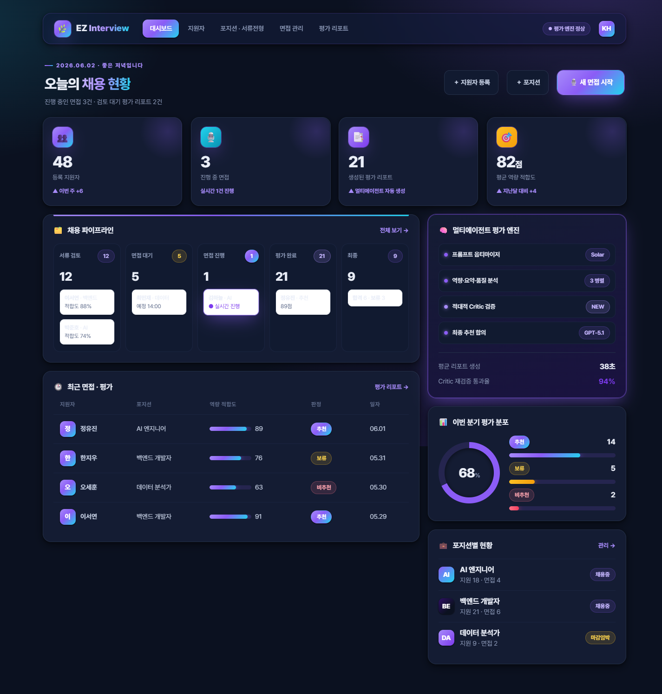
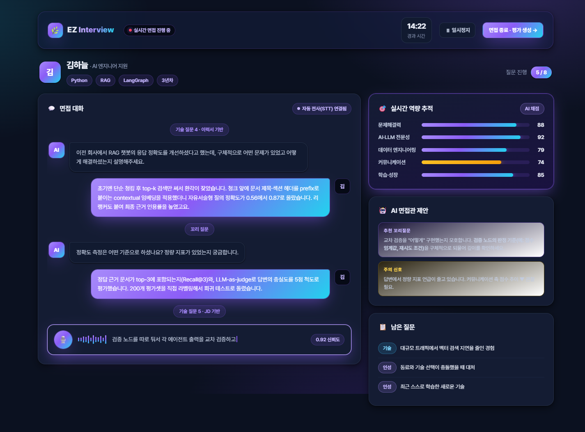
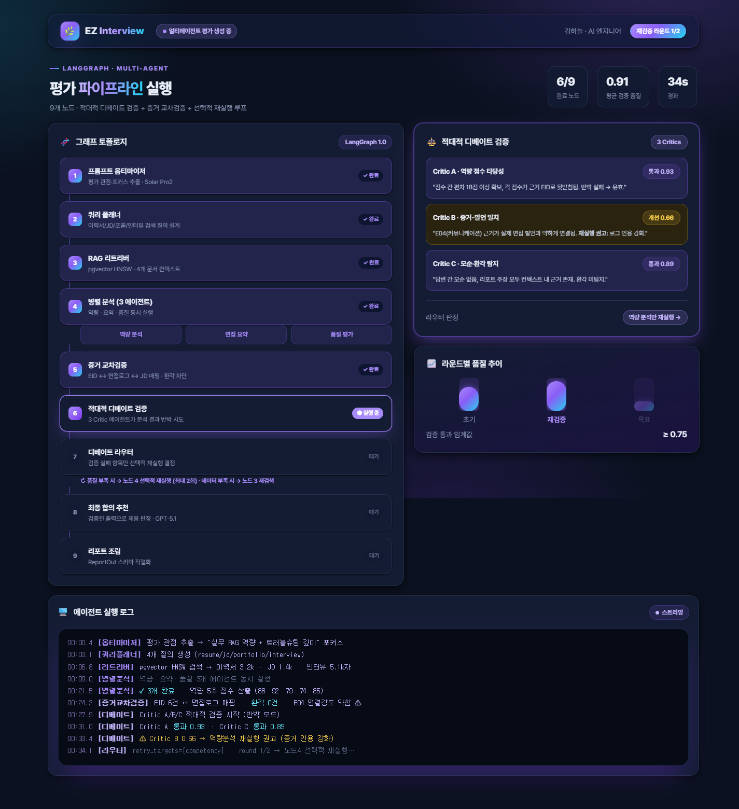
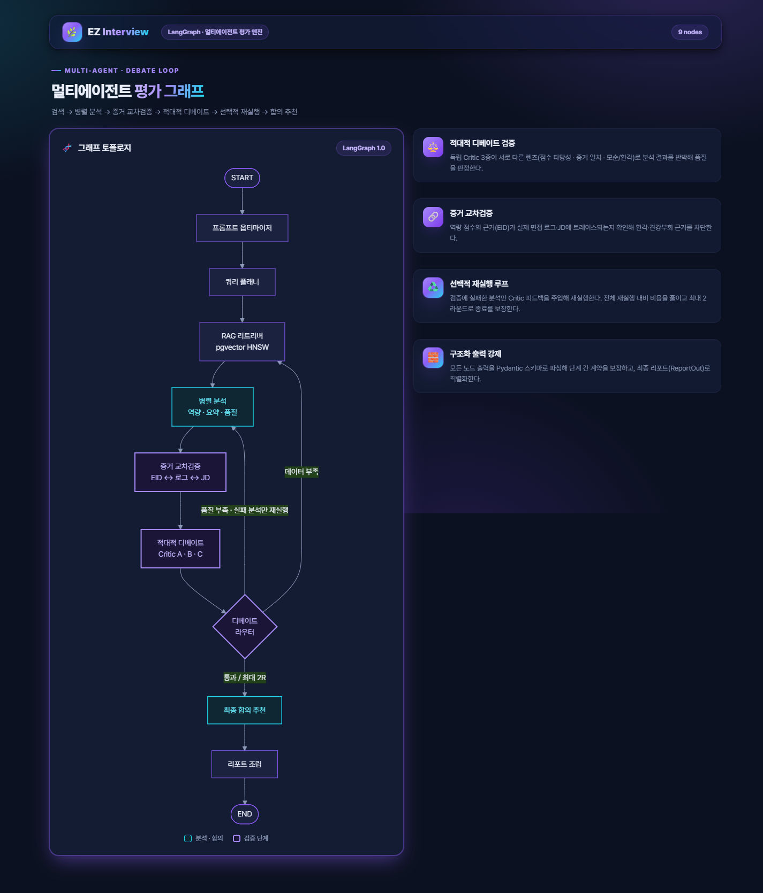
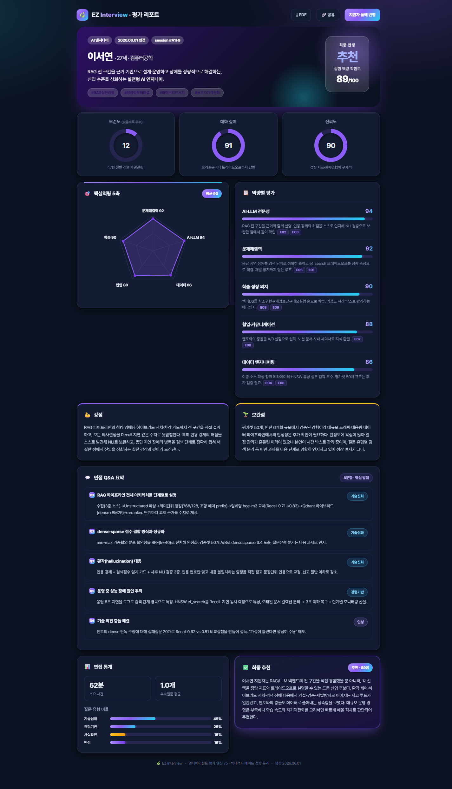
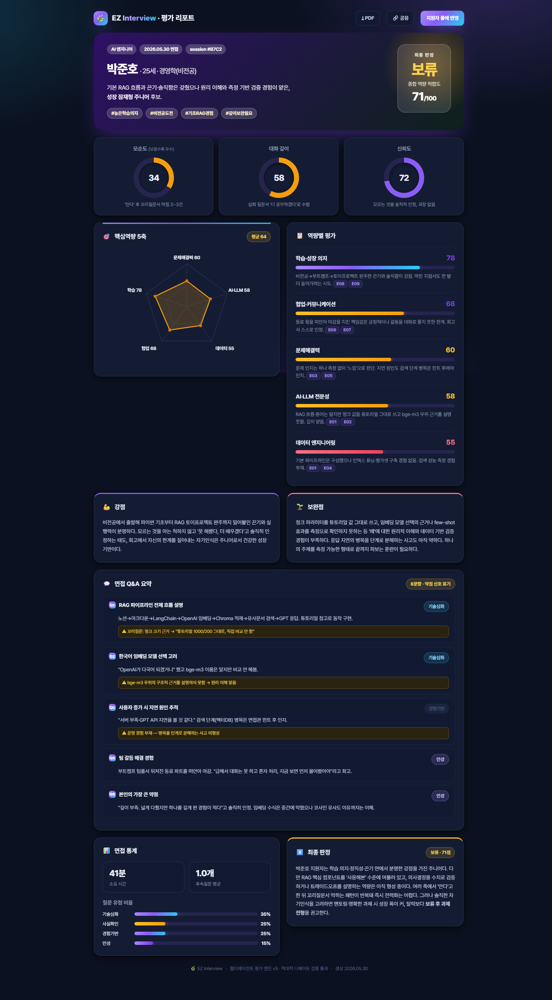
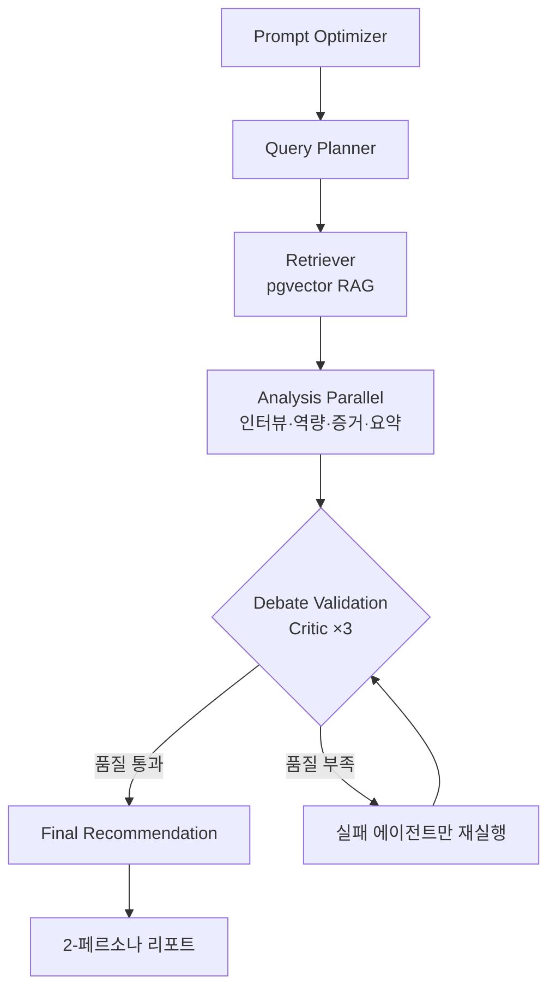

<div align="center">


### 🎙️ 실시간 음성 면접 + LangGraph 적대적 디베이트 평가

Vito gRPC STT로 면접을 실시간 받아쓰고, **LangGraph v5 멀티에이전트**가 답변을 채점한 뒤
**3종 Critic이 적대적으로 디베이트**해 점수를 재검증합니다.
환각 대신 **증거 교차검증**으로 통과·보류를 가립니다.

<br/>


</div>

---

## 주요 기능

- **실시간 음성 면접** — Vito gRPC STT로 마이크 음성을 즉시 텍스트화하고 Socket.IO로 화면에 흘려보냅니다.
- **RAG 기반 질문 생성** — 이력서·JD를 `pgvector`에 임베딩 → 직무·역량별 맞춤 질문을 RAG로 생성.
- **LangGraph v5 적대적 디베이트** — 분석 4종(인터뷰·역량·증거·요약) 실행 → **Critic 3종이 약점·논리·증거 부족을 공격** → 품질 부족 시 실패 에이전트만 선택적 재실행.
- **증거 교차검증** — 답변을 평가할 때 이력서·JD 청크의 출처(`chunk_id`)를 인용해 환각을 차단.
- **2-페르소나 리포트** — 후보자별 "추천 / 보류" 결정과 근거를 카드형 리포트로 정리.
- **포지션·프롬프트 관리** — 채용 포지션, 평가 프롬프트(글로벌·역량·요약·최종)를 어드민에서 직접 편집.

---

## 🖼️ 미리보기

| 대시보드 — 면접 현황 한눈에 | 실시간 음성 면접 화면 |
|:---:|:---:|
|  |  |
| **평가 파이프라인 — 4 분석 + 3 Critic** | **LangGraph v5 아키텍처** |
|  |  |
| **평가 리포트 — 추천 (이서연)** | **평가 리포트 — 보류 (박준호)** |
|  |  |

---

## 🔄 LangGraph v5 흐름



음성은 별도 경로로: `[Mic → Vito gRPC STT → Socket.IO → Question Agent]`

---

## 🚀 빠른 시작

```bash
# 1) 의존성
pip install -r requirements.txt

# 2) DB · 시크릿 (.env)
#   OPENAI_API_KEY · ANTHROPIC_API_KEY · VITO_CLIENT_ID/SECRET
#   POSTGRES_*  (pgvector 확장 활성화)

# 3) 인덱스 생성
psql -U postgres -d ezinterview -f app/db/migrations/create_interview_indexes.sql

# 4) 실행
python -m app.main   # http://127.0.0.1:5000
```

도커로 띄울 땐 루트 `Dockerfile` 사용.

---

## 🛠 기술 스택

| 영역 | 사용 기술 |
|---|---|
| **백엔드** | Flask 3 · Flask-SocketIO · gunicorn · python-dotenv |
| **AI / Agent** | LangGraph 1.0 · LangChain 1.0 · OpenAI · Anthropic |
| **RAG / DB** | PostgreSQL + pgvector · langchain-postgres · psycopg3 · SQLAlchemy 2 |
| **STT** | Vito gRPC (`vito-stt-client_pb2`) · PyAudio · grpcio |
| **문서 파싱** | PyMuPDF · python-docx · tiktoken |
| **프런트** | Jinja2 · Socket.IO 클라이언트 · 차분 톤 라이트 UI |

---

## 📁 디렉토리 구조

```text
app/
├── main.py            Flask + SocketIO 진입점
├── config/            환경/설정
├── db/
│   ├── db_connection.py
│   └── migrations/    create_interview_indexes.sql
├── routes/            dashboard · position · prompt · question · report · state · stream · stt_socket
├── agents/            embedding · question · stream · grammar
│   ├── report_agent_v5.py     ← 현행 (적대적 디베이트)
│   ├── report_agent_v4o.py    ← v5 공유 스키마 (Headline·InterviewSummary…)
│   └── report_prompt/         프롬프트 템플릿
├── utils/             RAG (indexer·retriever) · 문서 파싱 · 임베딩 · 상태
├── stt/               Vito gRPC 워커 · proto 산물
├── templates/         interview.html · admin 페이지
└── static/            css · js · 디자인 프리뷰

docs/
├── DEBATE_RETRY_PATTERN.md  ← v5 디베이트 패턴 설계
└── UI_REVAMP.md             ← UI 리뉴얼 의도

uploads/
├── jds/        런타임 JD 업로드 (.gitkeep만 트래킹)
└── report_prompt/  평가 프롬프트 (편집 대상)
```

---

## ⚠️ 알려진 사항

- **3인팀 프로젝트 (2025.11)** — 본인 담당: LangGraph 평가 파이프라인 v5, 디베이트 검증, RAG 파이프라인.
- **`report_agent_v4o.py`는 v5의 공유 의존성** (스키마: `Headline`, `InterviewSummary`, `InterviewStat`). 파일명은 v4이지만 현행 v5에서 import.
- **Postgres 필수** — `pgvector` 확장이 활성화되어 있어야 임베딩 인덱스가 동작합니다.
- **Vito 인증** — STT는 Vito API 키가 없으면 비활성화 모드로 떨어집니다.

<div align="center">


</div>
