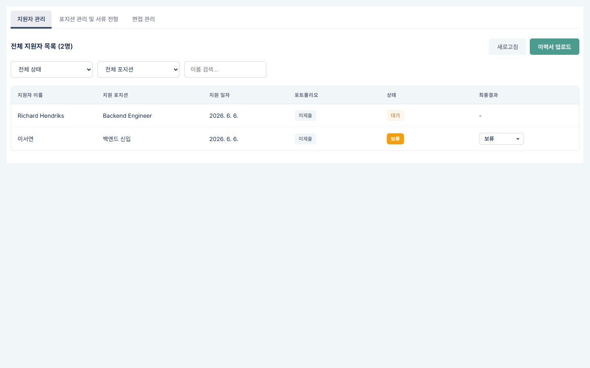
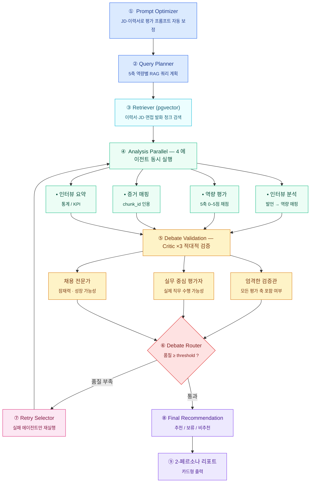

<div align="center">


### 🎙️ 실시간 음성 면접 + LangGraph 적대적 디베이트 평가

Vito gRPC STT로 면접을 실시간 받아쓰고, **LangGraph v5 멀티에이전트**가 답변을 채점한 뒤
**3종 Critic이 적대적으로 디베이트**해 점수를 재검증합니다.
환각 대신 **증거 교차검증**으로 통과·보류를 가립니다.

<br/>


</div>

---

## 주요 기능

- **실시간 음성 면접** — Vito gRPC STT(`vito_stt_client_pb2`)로 마이크 음성을 ~100ms 단위로 받아쓰고 `Flask-SocketIO`로 화면에 push. 발화 단위(`msg_turn`)와 시작 시점(`offset_sec`)을 함께 저장해 면접관이 답변 구간을 빠르게 되돌릴 수 있습니다.
- **RAG 기반 질문 생성** — 이력서·JD를 청킹 후 `text-embedding-3-small`(1536d)로 임베딩 → `rag.documents` 에 저장 → 직무·역량별 맞춤 질문을 RAG retrieval 후 생성.
- **LangGraph v5 적대적 디베이트** — 분석 4종(인터뷰·역량·증거·요약) **병렬 실행** → Critic 3종이 평가 누락·근거 부족·논리 비약을 공격 → 품질 부족 시 **실패한 에이전트만 선택적 재실행** (인터뷰 요약은 통계라 재실행 제외).
- **증거 교차검증** — 평가 발언마다 `chunk_id` 로 `rag.interview_logs` 발화·이력서·JD 청크를 역추적. 환각 / 약한근거 / 일치를 카운트해 품질 점수(0–1)로 산출.
- **5축 평가 리포트** — `문제해결 · 전문성 · 협업 · 성장가능성 · 태도` 각 축 0~5점 + Critic 통과 라벨 + 카드형 리포트(추천/보류/비추천).
- **포지션·프롬프트 관리** — 채용 포지션·평가 프롬프트(글로벌/역량/요약/최종) 어드민에서 직접 편집 + 백업·복구.
- **HNSW 인덱스 가속** — `rag.interview_logs.msg_embedding` 에 pgvector HNSW(cosine) 인덱스. 1만건 기준 벡터 검색 2.5초 → 0.02초.

---

## 🖼️ 미리보기

| 어드민 — 지원자 관리 (Richard Hendriks 샘플 등록 직후) | 실시간 음성 면접 화면 |
|:---:|:---:|
|  |  |
| **대시보드 — 면접 현황 한눈에** | **평가 파이프라인 — 4 분석 + 3 Critic 디베이트** |
|  |  |
| **LangGraph v5 아키텍처 다이어그램** | **평가 리포트 — 추천 (이서연)** |
|  |  |
| **평가 리포트 — 보류 (박준호)** | **(Richard 샘플 면접 시뮬레이션 결과 — `samples/`)** |
|  | _샘플 흐름은 [`samples/README.md`](samples/README.md) 와 `python -m app.main` 실행 후 README "빠른 시작 → 샘플 데이터" 섹션을 참조_ |

---

## 🔄 LangGraph v5 흐름 (9 노드 + 적대적 디베이트 루프)



음성은 별도 경로: `[Mic → Vito gRPC STT → Socket.IO → Question Agent → rag.interview_logs]`

### Critic 3종 캐릭터 (적대적 디베이트)

| Critic | 시각 | 던지는 질문 예시 |
|---|---|---|
| **엄격한 검증관** | 평가 5축 누락 여부 | "협업 능력 평가가 빠졌는데 이유가?" |
| **실무 중심 평가자** | 실제 직무 수행 가능성 | "N+1 사례가 진짜 본인 손인가, 인용인가?" |
| **채용 전문가** | 잠재력·성장 가능성 | "신입 기준 지금은 약해도 1년 뒤 강점이 될까?" |

### 평가 5축

`문제해결` · `전문성` · `협업` · `성장 가능성` · `태도`
— 각 축 **0~5점** 채점 + Critic이 점수 타당성 재검증해 `⚠ 개선 필요(0.70~0.85)` / `✓ 통과(0.90+)` 라벨링.

### 재실행 패턴 (`docs/DEBATE_RETRY_PATTERN.md`)

```
analysis (4 에이전트 초기 실행)
   ↓
debate_validation (Critic 3종)
   ↓
debate_router
   ├─ 품질 통과 → final_recommendation
   └─ 품질 부족 → retry_targets 결정 → analysis 재진입
                  (실패한 에이전트만 — 인터뷰 분석·역량 평가·증거 매핑)
                  ※ 인터뷰 요약은 통계 데이터라 재실행 제외
```

### 증거 추적 (환각 차단)

평가 발언마다 `(:Evidence)` 노드를 `chunk_id` 로 묶어 `rag.interview_logs` 발화·이력서 청크에 역추적합니다.
시뮬레이션 1건 결과 — **환각 4건 · 약한근거 1건 · 품질 0.70** 으로 채점되어 `on_hold` 판정.

---

## 🚀 빠른 시작 (4단계, 5분)

```bash
# 1) 환경변수
cp .env.example .env          # OPENAI_API_KEY 만 채우면 끝 (DB 값은 기본 그대로 OK)

# 2) Postgres + pgvector (자동 스키마/인덱스 적용)
docker compose up -d          # 5433 포트 · app/db/migrations/* 가 첫 기동시 자동 실행

# 3) 파이썬 의존성
pip install -r requirements.txt

# 4) 실행
python -m app.main            # http://127.0.0.1:5000
```

### 샘플 데이터로 즉시 확인

`samples/` 에 공개 라이선스 이력서·JD 가 있어 별도 데이터 준비 없이 흐름을 검증할 수 있습니다.

```bash
# 후보자 등록 (이력서 업로드)
curl -X POST http://127.0.0.1:5000/api/candidates/upload \
  -F "file=@samples/Richard Hendriks_이력서.pdf" \
  -F "position=Backend Engineer"

# 채용 공고 등록
curl -X POST http://127.0.0.1:5000/api/positions \
  -F "file=@samples/Sample_BackendEngineer_JD.pdf" \
  -F "name=Acme Tech Backend (Sample)"
```

샘플 출처·라이선스는 [`samples/README.md`](samples/README.md) 참조.

---

## 🛠 기술 스택

| 영역 | 사용 기술 |
|---|---|
| **백엔드** | Flask 3 · Flask-SocketIO · gunicorn · python-dotenv |
| **AI / Agent** | LangGraph 1.0 · LangChain 1.0 · OpenAI · Anthropic |
| **RAG / DB** | PostgreSQL + pgvector · langchain-postgres · psycopg3 · SQLAlchemy 2 |
| **STT** | Vito gRPC (`vito-stt-client_pb2`) · PyAudio · grpcio |
| **문서 파싱** | PyMuPDF · python-docx · tiktoken |
| **프런트** | Jinja2 · Socket.IO 클라이언트 · 차분 톤 라이트 UI |

---

## 📁 디렉토리 구조

```text
app/
├── main.py            Flask + SocketIO 진입점
├── config/            환경/설정
├── db/
│   ├── db_connection.py
│   └── migrations/    create_interview_indexes.sql
├── routes/            dashboard · position · prompt · question · report · state · stream · stt_socket
├── agents/            embedding · question · stream · grammar
│   ├── report_agent_v5.py     ← 현행 (적대적 디베이트)
│   ├── report_agent_v4o.py    ← v5 공유 스키마 (Headline·InterviewSummary…)
│   └── report_prompt/         프롬프트 템플릿
├── utils/             RAG (indexer·retriever) · 문서 파싱 · 임베딩 · 상태
├── stt/               Vito gRPC 워커 · proto 산물
├── templates/         interview.html · admin 페이지
└── static/            css · js · 디자인 프리뷰

docs/
├── DEBATE_RETRY_PATTERN.md  ← v5 디베이트 패턴 설계
└── UI_REVAMP.md             ← UI 리뉴얼 의도

uploads/
├── jds/        런타임 JD 업로드 (.gitkeep만 트래킹)
└── report_prompt/  평가 프롬프트 (편집 대상)
```

---

## ⚠️ 알려진 사항

- **3인팀 프로젝트 (2025.11)** — 본인 담당: LangGraph 평가 파이프라인 v5, 디베이트 검증, RAG 파이프라인.
- **`report_agent_v4o.py`는 v5의 공유 의존성** (스키마: `Headline`, `InterviewSummary`, `InterviewStat`). 파일명은 v4이지만 현행 v5에서 import.
- **Postgres 필수** — `pgvector` 확장이 활성화되어 있어야 임베딩 인덱스가 동작합니다.
- **Vito 인증** — STT는 Vito API 키가 없으면 비활성화 모드로 떨어집니다.

<div align="center">


</div>
